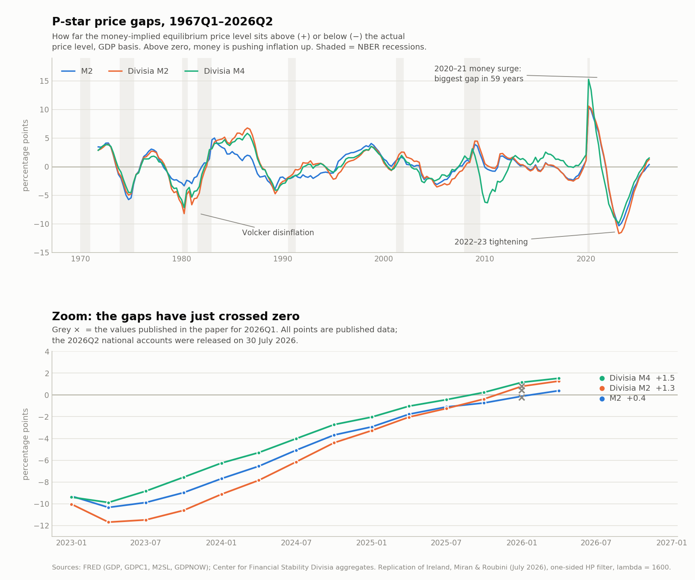
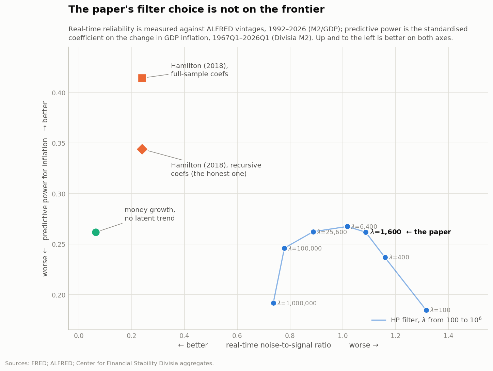
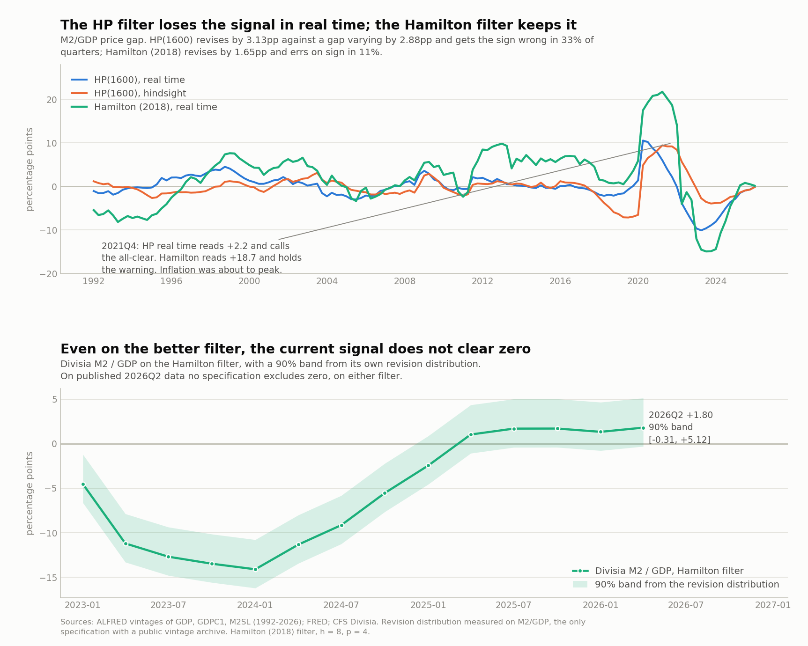
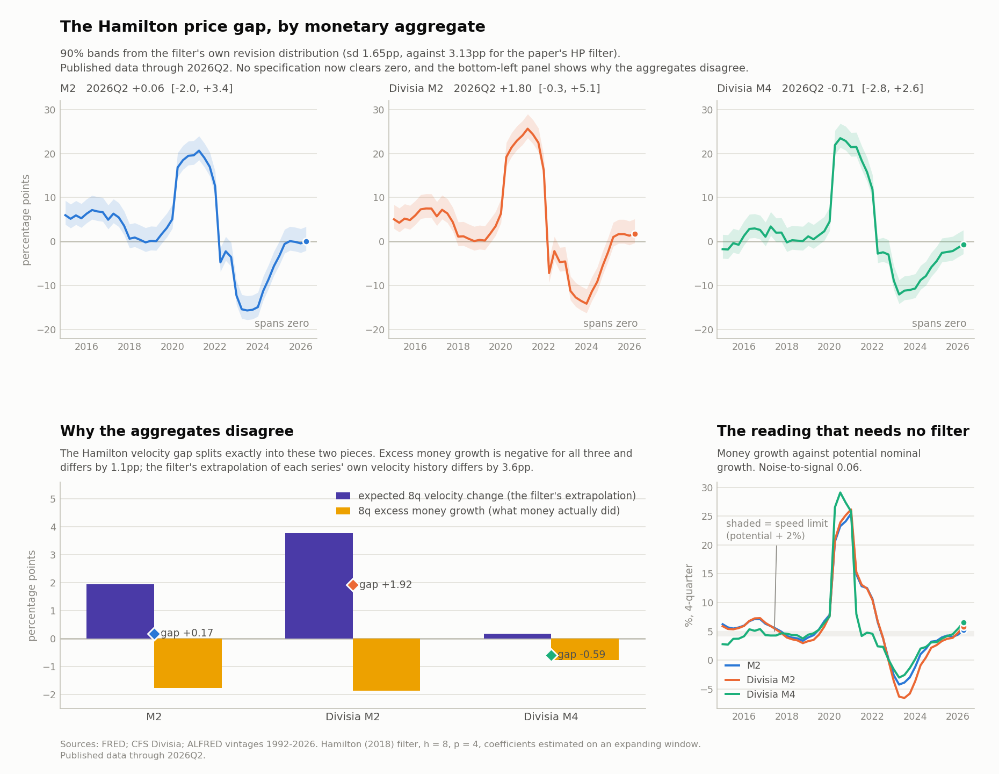

# The P-Star Price Gap Is Not Identified in Real Time

### A replication and extension of Ireland, Miran and Roubini (2026)

**Joshua Johnson** · Independent researcher

*Draft, 4 August 2026. Comments welcome. This version replaces the 30 July draft, in
which the 2026Q2 figures were a nowcast; they are now published data. See Section 8.1.*

Replication code and data: <https://github.com/josjo80/pstar-monetarism>

---

## Abstract

Ireland, Miran and Roubini (2026) revive the Hallman–Porter–Small (1991) P-star model,
estimate it on Divisia monetary aggregates through 2026Q1, and conclude that the stance of
monetary policy is "quite close to neutral," that recent high inflation is therefore
attributable to adverse supply shocks, and that the Federal Reserve should adopt a "wait
and see" posture. I reproduce their Table 1 to within 0.02 on every coefficient and their
reported potential-growth diagnostics to within 0.03 percentage points, then subject the
framework to four tests they do not perform.

First, I reconstruct the price gap from ALFRED vintages as a policymaker would have seen it
at each date. The revision standard deviation is 3.13 percentage points against a gap whose
own standard deviation is 2.88 — a noise-to-signal ratio of 1.09 — and real-time and
hindsight estimates disagree on the *sign* of the policy stance in 33% of quarters. Applying
this revision distribution, the 90% band on every one of their six 2026Q1 price gaps spans
zero. The paper's central quantitative claim is not identified in real time. The failure is
almost entirely filter endpoint (revision sd 3.13) rather than data revision (0.31).

Second, I locate the cause. The gap requires estimating two unobserved trends at the sample
endpoint. Removing potential output (the nominal-GDP framing) achieves almost nothing;
removing both trends by using 4-quarter money growth reduces noise-to-signal to 0.06 and
real-time sign errors to zero, at no cost in predictive accuracy. An attempt to estimate
equilibrium velocity structurally from CFS user-cost data across eight specifications fails:
none is cointegrated (Engle–Granger ADF −1.68 to −2.17 against a 5% critical value of −3.34).

Third, and most constructively, the problem is the filter rather than the price gap. The
Hamilton (2018) regression filter dominates every HP variant on real-time reliability *and*
predictive power simultaneously — noise-to-signal 0.24, sign errors 11%, standardised effect
0.356 against 0.267, out-of-sample RMSE gain over an AR(4) of 5.8% against 3.5%. Decisively,
at 2021Q4 with inflation about to peak, the HP gap read +2.2 in real time against a
hindsight value of +9.2, having decayed to neutral; the Hamilton gap read +18.7 against
+21.8 and held the warning throughout. The paper's own central historical claim — that money
gave a usable advance warning of the post-2020 inflation — survives only under a filter it
does not use.

Fourth, I test the supply-shock attribution the paper asserts but never estimates. The price
gap survives the addition of measured supply variables (γ rises slightly, to 0.093, HAC
t = 2.76), so it is not a repackaged supply shock. But over 2025Q1–2026Q1 oil contributes
+0.00pp because oil *fell* through 2025, while tariffs contribute +1.17pp of the +2.03pp rise
in PCE inflation. The deglobalization half of the paper's explanation holds; the energy half
does not, for the window it is invoked to explain. Meanwhile 2026Q2 records the third-largest
oil shock since 1946, implying +1.5 to +2.1pp on inflation by 2027Q1 — an order of magnitude
larger than any monetary signal here, and arriving roughly a year earlier than the paper's
own hedge anticipated.

On both filters the current stance is indistinguishable from neutral: on 2026Q2 data no
specification has a 90% band excluding zero. The six specifications also disagree far more
under Hamilton than under HP, which undercuts the paper's claim that the choice of aggregate
"hardly matters," and what signal there is comes largely from the filter's extrapolation of
past velocity rather than from money. The reading I would defend is the one requiring no
filter at all: money growing 5.3–6.6% over four quarters against a 4.25–5.0% speed limit,
i.e. **modestly above sustainable, with all aggregates agreeing.**

*JEL: E31, E41, E52, C22. Keywords: P-star, Divisia monetary aggregates, real-time data,
Hodrick–Prescott filter, inflation forecasting.*

---

## 1. Introduction

Ireland, Miran and Roubini (2026, hereafter IMR) make a case that deserves to be taken
seriously. Monetary aggregates have been effectively absent from Federal Reserve analysis for
two decades; the post-2020 inflation was preceded by an extraordinary money surge; and a
growing literature (Belongia and Ireland 2016; Bordo, Duca and Jones 2025; Ireland 2025)
finds that Divisia aggregates restore empirical content that simple sums had lost. IMR
operationalise this by updating the Hallman–Porter–Small (1991) P-star model with Divisia
money, one-sided filtering, and a consumption-based variant, and they report a strikingly
consistent price-gap coefficient of about 0.10 across six specifications.

Their policy conclusion follows from a level reading: as of 2026Q1 the six price gaps span
−0.36 to +0.79, which they characterise as "quite close to neutral." From this they infer
that recent high inflation reflects supply shocks and measurement error rather than money,
and that the Fed should therefore look through it.

This paper accepts the framework and interrogates the inference. My concern is not with the
quantity theory, with Divisia aggregation, or with the choice of transactions variable — all
of which I find hold up. It is with a single implementation choice whose consequences the
paper does not examine: the use of a one-sided Hodrick–Prescott filter with λ = 1600 to
estimate two unobserved trends at the endpoint of the sample.

The exercise is in the spirit of Ireland (2025), whose subtitle is "Measurement Issues and
Recent Results" and whose argument is that measurement decisions drive what one concludes
about the money–inflation link. I extend that argument one step: for a gauge intended to
inform policy in real time, the binding measurement question is not which aggregate is used
but how much of the resulting estimate survives contact with the vintage of data that
actually existed when the decision had to be made.

Section 2 documents the replication. Section 3 establishes that the resulting gap is not
identified in real time. Section 4 traces the cause to latent-trend estimation. Section 5
shows that a different filter substantially repairs the problem, and that this rescues IMR's
own historical claim about 2021. Section 6 tests the supply-shock attribution. Section 7
gives the current reading with honest bands. Section 8 discusses implications, and Section 9
lists what I could not resolve.

Two prior results frame everything below. Orphanides and van Norden (2002) showed that
real-time output-gap estimates are so unreliable as to be nearly useless for policy; the
P-star price gap contains an output gap as one of its two components, so the problem should
be expected to carry over, and I find that it does. Hamilton (2018) argued that the HP filter
should never be used, partly because of its endpoint behaviour; the central constructive
result here is a quantification of what that costs in this specific application, and what
using his alternative buys.

## 2. Replication

### 2.1 Model and data

The equation of exchange with transactions variable *x* (real GDP or real PCE) gives velocity
*V = Px/M*, and P-star is defined as *P\* = MV\*/x\**, where *V\** and *x\** are one-sided HP
trends with λ = 1600. In logs the money stock cancels:

> price gap = (*v\** − *v*) + (*x* − *x\**) = velocity gap + output gap

which is why a Divisia index normalised to 100 in 1967 requires no rescaling. The estimating
equation is Hallman–Porter–Small's:

> Δπ*t* = α + Σ*i*=1..4 β*i* Δπ*t−i* + γ (*p\*t−1* − *pt−1*) + ε*t*

Data are FRED (`GDP`, `GDPC1`, `PCECC96`, `PCECTPI`, `M2SL`) and the Center for Financial
Stability Divisia M2 and M4 aggregates, exactly as in IMR. Sample 1967Q1–2026Q1, n = 217.

### 2.2 Results

Table 1 reproduces closely.

**Table 1. Replication of IMR Table 1: price-gap coefficient γ**

| Transactions | Money | γ (this paper) | γ (IMR) | t | IMR t | R² | IMR R² |
|---|---|---|---|---|---|---|---|
| GDP | M2 | 0.100 | 0.10 | 3.97 | 3.95 | 0.180 | 0.18 |
| GDP | Divisia M2 | 0.079 | 0.08 | 3.70 | 3.94 | 0.173 | 0.18 |
| GDP | Divisia M4 | 0.084 | 0.09 | 3.78 | 3.91 | 0.175 | 0.18 |
| PCE | M2 | 0.125 | 0.12 | 3.81 | 3.88 | 0.193 | 0.19 |
| PCE | Divisia M2 | 0.101 | 0.11 | 3.66 | 3.91 | 0.188 | 0.19 |
| PCE | Divisia M4 | 0.101 | 0.10 | 3.46 | 3.63 | 0.183 | 0.19 |

The lag structure also matches (GDP specification: −0.38, −0.13, 0.01, 0.10 against IMR's
−0.38, −0.15, 0.00, 0.08). Two diagnostics IMR state in prose reproduce independently: my
one-sided HP estimate of potential growth over the four quarters to 2026Q1 is 2.48% against
their 2.45%, and CBO's is 2.27% against their 2.24%. My HP output gap is negative (−0.47) and
the CBO gap positive (+0.98), matching their Figure 4 discussion.

Gap *levels* for 2026Q1 run about 0.2pp above the published values (Divisia M4/GDP +1.02 here
against +0.79). This is vintage, not method: 2026Q1 real GDP was revised up 0.115% after
their publication, and the CFS revises its history monthly. I ruled out filter start date,
implicit versus chain-type deflator, and recursive-HP versus Stock–Watson Kalman
implementation (the latter two agree to 1.3 × 10⁻⁸, as they must, since the smoother at the
endpoint equals the filter).

I regard the replication as successful and the discrepancies as immaterial.

**Figure 1.** P-star price gaps, 1967Q1–2026Q2, GDP basis, all three monetary aggregates.
Grey crosses mark IMR's published 2026Q1 values.

## 3. The gap is not identified in real time

IMR justify the one-sided filter on real-time grounds: it "can be used to produce estimates
of equilibrium velocity in real time, which can then be used by policymakers in practice."
But their estimates are computed on final, revised data. A one-sided filter applied to
information nobody possessed at the time is not a real-time exercise.

I therefore rebuild the gap from ALFRED vintages. For each quarter *t* from 1992Q1 to 2026Q1
I take the vintage published two months after *t* closes — roughly when the FOMC would first
have quarter *t*'s national accounts — truncate to data through *t*, and compute the endpoint
gap. This requires 414 archived series-vintages and is possible only for the simple-sum M2
specifications, since the CFS publishes no vintage archive; M2/GDP is IMR's own baseline.

**Table 2. Real-time reliability of the P-star price gap (M2/GDP, 1992–2026, n = 137)**

| | vs final two-sided | vs 5-year hindsight |
|---|---|---|
| sd of revision | 3.13pp | 2.16pp |
| sd of the gap itself | 2.88pp | 2.34pp |
| **noise-to-signal** | **1.09** | **0.93** |
| correlation, real-time vs benchmark | 0.47 | 0.57 |
| **sign disagreements** | **33%** | **33%** |

The revision is as large as the object being measured. I report two benchmarks because the
full-sample two-sided filter smears the 2020 collapse backwards over preceding years; the
five-year-hindsight variant avoids that and gives the same qualitative answer.

Decomposing, the problem is not the data:

| component | sd |
|---|---|
| filter endpoint (final two-sided − final one-sided) | 3.13pp |
| data revision (final one-sided − real-time) | 0.31pp |

This is the Orphanides–van Norden result carrying over, an order of magnitude more severe
than data revision. Applying the empirical revision distribution to IMR's 2026Q1 estimates,
the 90% band on all six spans zero — as does the band on my own updated reading, and on any
claim that the gaps have "crossed zero."

## 4. Why: latent trends, not money

The gap requires two unobserved trends. Which one does the damage? Using the identity that
with *n* = *p* + *x* and *n\** = *m* + *v\**, the nominal-GDP gap *n\** − *n* collapses to the
velocity gap, dropping *Y\** entirely; one rung further, money growth relative to nominal GDP
growth requires no trend at all.

**Table 3. Real-time reliability down the latent-trend ladder**

| indicator | latent trends | sd(revision) | noise/signal | corr | sign errors |
|---|---|---|---|---|---|
| price gap | *V\**, *Y\** | 3.13 | 1.09 | 0.47 | 33% |
| velocity gap (= nominal gap) | *V\** | 3.48 | 0.99 | 0.55 | 37% |
| **money growth, 4q** | none | **0.27** | **0.06** | **1.00** | **0%** |
| money growth less nominal GDP growth | none | 0.75 | 0.13 | 0.99 | 4% |

Dropping *Y\** buys almost nothing: equilibrium velocity is doing the damage. Dropping both is
an eighteen-fold improvement in noise-to-signal and eliminates sign errors entirely.

Nor is anything given up. Predicting the change in GDP inflation with Divisia M2, raw money
growth matches the price gap almost exactly in sample (standardised effect 0.268 against
0.267; R² 0.169 against 0.170; HAC t 2.74 against 2.51) and slightly beats it out of sample
from 1990 (RMSE gain over an AR(4) of 3.82% against 3.48%).

I also attempted to estimate *V\** structurally rather than filter it, since IMR explicitly
call for this ("one of our purposes in writing this article is to call for a renewal of this
line of economic research"), and the CFS workbook already ships the required user-cost
duals. Eight specifications were tried, crossing two opportunity-cost measures (the Divisia
real user-cost aggregate; the 3-month Treasury bill less the CFS own-rate aggregate), current
versus HP-trended opportunity cost, and full-sample versus recursive Stock–Watson dynamic OLS
estimation of the cointegrating vector. **The attempt fails.** No variant is cointegrated
(Engle–Granger ADF −1.68 to −2.17 against a 5% critical value of −3.34); no variant repairs
the 1990–2019 window; the best-behaved variant simply reproduces the HP baseline (full-sample
γ 0.081 against 0.079); and the user-cost variants are actively worse, flipping γ negative
over 2020–2026 because the user cost spikes during hiking cycles, dragging *V\** with it so
that tightening registers as expansionary. I report this because it narrows the problem: the
difficulty is in the data, not in the choice of estimator for *V\**.

## 5. The filter, not the gap

The remaining possibility is that λ = 1600 is simply wrong. I sweep λ from 100 to 10⁶ and add
the Hamilton (2018) regression filter, which regresses log velocity on its own values eight
to eleven quarters earlier and calls the residual the cycle. Each variant is scored on real-time reliability (ALFRED
vintages, M2/GDP) and on predicting the change in inflation (Divisia M2), in sample and out.

**Table 4. The filter frontier**

| variant | noise/signal | sign err | std. effect | HAC t | R² | OOS gain | DM t |
|---|---|---|---|---|---|---|---|
| HP λ=100 | 1.32 | 36% | 0.192 | 1.70 | 0.146 | 0.3% | −0.10 |
| HP λ=400 | 1.16 | 38% | 0.243 | 2.30 | 0.162 | 2.9% | −1.08 |
| **HP λ=1,600** (IMR) | 1.09 | 33% | 0.267 | 2.51 | 0.170 | 3.5% | −1.13 |
| HP λ=6,400 | 1.02 | 27% | 0.272 | 2.54 | 0.171 | 3.2% | −1.09 |
| HP λ=25,600 | 0.89 | 28% | 0.265 | 2.54 | 0.168 | 2.6% | −0.97 |
| HP λ=100,000 | 0.78 | 30% | 0.246 | 2.47 | 0.161 | 1.6% | −0.70 |
| HP λ=10⁶ | 0.74 | 38% | 0.187 | 2.06 | 0.145 | −0.4% | +0.25 |
| Hamilton, full-sample coefs | 0.24 | 11% | 0.415 | 4.54 | 0.224 | 6.7% | −1.58 |
| **Hamilton, recursive coefs** | **0.24** | **11%** | **0.356** | **2.81** | **0.249** | **5.8%** | **−1.73** |
| money growth (no trend) | 0.06 | 0% | 0.268 | 2.74 | 0.169 | 3.8% | −1.29 |

Within the HP family there is a genuine tradeoff — noise-to-signal falls monotonically in λ
while predictive power peaks near λ = 6,400 — so IMR's choice is dominated even inside its own
family, though only mildly. The substantive result is that the Hamilton filter beats every HP
variant on *both* axes at once. This is not a frontier position but a strict improvement, and
it is what Hamilton argued: his trend is a forecast constructed from data eight quarters
earlier, so it has no endpoint to revise, and the only revision comes from re-estimated
coefficients and from data.

The recursive row is the honest one. Applying full-sample Hamilton coefficients to historical
dates is a look-ahead and inflates the standardised effect from 0.356 to 0.415 and the HAC
t from 2.81 to 4.54. After correction Hamilton still dominates λ = 1600 on every column, and
its Diebold–Mariano statistic of −1.73 is the closest any indicator examined here comes to
beating an AR(4) — short of two-sided significance, borderline one-sided.

**Figure 2.** Real-time reliability against predictive power. Up and to the left is better on
both axes.

### 5.1 The 2021 episode

The decisive evidence is IMR's own central historical claim. Their Figure 3 discussion asks
whether the FOMC, watching money with the P-star model, "might they have ended QE and raised
interest rates sooner." The real-time reconstruction answers it.

**Table 5. M2/GDP price gap through the pandemic episode**

| | HP real-time | HP hindsight | Hamilton real-time | Hamilton hindsight |
|---|---|---|---|---|
| 2020Q2 | 10.6 | 4.8 | 17.5 | 17.4 |
| 2020Q4 | 8.8 | 7.3 | 20.8 | 21.4 |
| 2021Q2 | 6.0 | 9.5 | 21.8 | 23.9 |
| **2021Q4** | **2.2** | **9.2** | **18.7** | **21.8** |
| 2022Q1 | −0.1 | 8.4 | 14.0 | 18.4 |

The HP gap catches the initial surge and then decays to roughly neutral by 2021Q4 — calling
the all-clear at the moment inflation was about to peak — while the hindsight estimate says
the impulse was still near its maximum. Across 2021 the HP real-time average was +5.0 against
a hindsight +9.1. The Hamilton gap read +18.7 at 2021Q4 against +21.8, averaging +20.4 against
+22.8 across the year: an unmistakable warning held through the entire episode.

The conclusion cuts in IMR's favour on substance and against them on method. Money *did*
contain a usable real-time warning about the post-2020 inflation. Their implementation would
have discarded it.

**Figure 3.** Top: what a policymaker saw at the time versus in hindsight, under both filters.
Bottom: the current reading on the Hamilton filter with a 90% band from its own revision
distribution.

## 6. Testing the supply-shock attribution

IMR's policy recommendation rests on an attribution they never estimate. Having found the gap
near zero, they conclude that recent inflation "is more likely to reflect a combination of
adverse supply shocks — for instance, energy shocks, deglobalization shocks like concerns over
supply chain security, and more — and measurement error." No supply variable appears in any
of their regressions; the residual is assigned a name.

I add two measured supply variables available over the full sample: Hamilton's (1996) net oil
price increase, and the change in the effective tariff rate (BEA customs duties over imports
of goods and services), the paper's "deglobalization shock" made operational. Import prices
(1983 onward) and the all-commodities PPI serve as robustness.

**Table 6. Does the money signal survive supply controls? (1967Q1–2026Q1, HAC 4)**

| Spec | γ base | γ + supply | HAC t | R² base | R² + supply | F(supply) |
|---|---|---|---|---|---|---|
| M2/GDP | 0.100 | 0.110 | 2.78 | 0.180 | 0.263 | 2.83 |
| Divisia M2/GDP | 0.079 | 0.093 | 2.76 | 0.173 | 0.263 | 3.09 |
| Divisia M4/GDP | 0.084 | 0.101 | 2.85 | 0.175 | 0.266 | 3.16 |
| M2/PCE | 0.125 | 0.121 | 3.69 | 0.193 | 0.327 | 5.08 |
| Divisia M2/PCE | 0.101 | 0.106 | 3.49 | 0.188 | 0.330 | 5.34 |
| Divisia M4/PCE | 0.101 | 0.102 | 3.60 | 0.183 | 0.322 | 5.19 |

γ is stable or slightly higher throughout, and the supply block is jointly significant.
Robust to dropping contemporaneous supply terms (γ 0.090–0.115) and to adding import prices
and PPI, where R² reaches 0.596 while γ holds at 0.067 (t = 3.08). **The price gap is not a
repackaged supply shock**, which is a genuine point in IMR's favour. It also indicates their
reported R² of 0.18 leaves a good deal on the table.

**Table 7. Cumulated contributions to the change in inflation, 2025Q1–2026Q1 (pp)**

| | GDP deflator | PCE |
|---|---|---|
| **actual change** | **+1.14** | **+2.03** |
| inertia | −0.92 | −0.56 |
| money (price gap) | −1.13 | −1.34 |
| **oil** | **+0.00** | **+0.01** |
| **tariffs** | **−0.54** | **+1.17** |
| constant | −0.93 | −1.27 |
| **unexplained** | **+4.66** | **+4.00** |

Two findings. The **deglobalization half of the story holds**: tariffs account for over half
the rise in PCE inflation, the measure the Fed targets, and the GDP/PCE asymmetry is
economically coherent, since the GDP deflator excludes imports. The **energy half does not**:
oil *fell* through 2025, from $71.84 in 2025Q1 to $59.64 in 2025Q4, so no energy shock existed
during the window invoked to explain the inflation. And a large residual survives that neither
money nor measured supply explains — though in proportion, about one residual standard
deviation per quarter with four of five quarters positive: persistent, not individually
extraordinary.

Two caveats. The 2025Q2 tariff move of +4.30pp is the largest quarterly change since the
series begins in 1959, against a next-largest of +1.50pp in 1971Q4, so the coefficient is
extrapolated far outside the range identifying it; treat those contributions as indicative.
And PPI as a regressor explains prices with prices, so I weight it lightly.

### 6.1 The shock is arriving now

2026Q2 records a net oil price increase of 28.5 — rank 3 of 321 quarters since 1946, behind
only 1974 and 1979H2 — as WTI moved $59.64 → $71.98 → $95.75. Applying the estimated
pass-through:

| | GDP deflator | PCE |
|---|---|---|
| cumulated effect on inflation by 2027Q1 | **+1.52pp** | **+2.09pp** |
| money signal (γ × 2026Q1 gap), for scale | +0.06pp | +0.06pp |

IMR hedged on precisely this contingency — "if oil prices continue to climb in the second half
of 2027, then policy ought to move from neutral to restrictive" — but it is occurring roughly
a year earlier. Because the net-oil-price-increase transform is asymmetric, a partial reversal
would not net this off.

The first quarter of evidence is consistent with it. GDP deflator inflation rose from 3.53%
in 2026Q1 to **6.09%** in 2026Q2, and PCE inflation from 4.51% to 5.00%. One quarter is not a
test of a four-quarter projection, and no part of that increase is here attributed to any
particular cause. But the direction and rough scale are what the oil pass-through implies,
and they are not what the monetary signal implies: over the same quarter the price gap was
worth between −3 and +11 basis points on inflation.

## 7. Coefficient stability and attenuation

IMR describe γ ≈ 0.10 as "strikingly consistent" and offer it as a rule of thumb. Estimated
on 1990–2019 it is approximately zero in all six specifications, and Newey–West 95% intervals
for the three GDP-based specifications **exclude 0.10**. Over 2020–2026 all six exclude zero.

No formal test of *constancy* rejects, however: Quandt–Andrews sup-Wald with a wild bootstrap
gives p = 0.30–0.81; Chow tests at pre-specified 1984Q1 and 2020Q1 dates give p = 0.64–0.98
and p = 0.11–0.76; threshold regressions on three state variables give p = 0.05–0.91. The
sup-Wald search window is only 1980Q1–2018Q1, since 15% trimming places a 2020 break out of
reach — hence the pre-specified Chow tests. Break tests fail here because they must detect a
change against noise in both windows.

Measurement error explains part of this. With the noise variance known from Section 3,
classical attenuation gives γ_obs = γ_true × var(gap)/(var(gap) + var(noise)), and the gap's
variance differs by a factor of four across windows:

| Divisia M2/GDP | sd(gap) | signal share | γ observed | implied γ_true |
|---|---|---|---|---|
| 1967–1983 | 3.60 | 0.57 | 0.113 | **0.199** |
| 1990–2019 | 1.79 | 0.25 | 0.002 | 0.006 |
| 2020–2026 | 6.95 | 0.83 | 0.171 | **0.206** |

The 1970s and 2020s imply nearly identical structural coefficients from very different
observed ones, suggesting IMR's 0.10 understates the structural parameter by roughly half.

**But attenuation is not the whole story.** If it were, an indicator measured almost without
error should show no regime dependence. Money growth is such an indicator (signal shares
0.985–0.999) and shows the same pattern, with the 2020–2026 versus 1990–2019 difference
significant at t = 3.14, against 2.66 for the price gap. Cleaning up measurement error makes
the regime dependence sharper, not weaker. Both things hold: measurement error inflates how
unstable the *price gap* coefficient appears, and genuine regime dependence lies underneath
that attenuation cannot explain away.

## 8. The current reading

**Table 8. Stance of policy, Hamilton filter, published data through 2026Q2**

| Spec | 2026Q1 | 2026Q2 | 90% band | excludes zero? |
|---|---|---|---|---|
| M2/GDP | −0.41 | +0.06 | [−2.05, +3.38] | no |
| Divisia M2/GDP | +1.33 | +1.80 | [−0.31, +5.12] | no |
| Divisia M4/GDP | −1.40 | −0.71 | [−2.81, +2.61] | no |
| M2/PCE | +0.34 | +1.01 | [−1.10, +4.33] | no |
| Divisia M2/PCE | +1.12 | +1.94 | [−0.17, +5.26] | no |
| Divisia M4/PCE | −1.62 | −0.64 | [−2.74, +2.69] | no |

**No specification excludes zero**, on this filter or on IMR's, where the same six gaps run
+0.38 to +1.64 against a band roughly three times as wide. The implied effect on inflation
is −3 to +11 basis points, every interval spanning zero.

Even so, the differences across aggregates are large — Divisia M2 reads +1.80 while Divisia
M4 reads −0.71 — and that gap is worth stating precisely, because it is not about money. The
Hamilton velocity gap decomposes exactly (verified to 10⁻⁶) into an expected 8-quarter
velocity change implied by the series' own fitted dynamics, plus actual 8-quarter excess money
growth:

| aggregate | extrapolation | excess money growth | = gap |
|---|---|---|---|
| M2 | +1.95 | −1.78 | +0.17 |
| **Divisia M2** | **+3.78** | −1.86 | **+1.92** |
| **Divisia M4** | **+0.18** | −0.77 | **−0.59** |

Actual excess money growth is negative for all three and differs across them by 1.1pp; the
extrapolation differs by 3.6pp, and that is where essentially all the disagreement
originates. The Hamilton regression is fitted over 1967–2026, across which mean 8-quarter
velocity changes were −0.71 (M2), +1.39 (Divisia M2) and +1.56 (Divisia M4), while over the
past decade all three have velocity falling. The extrapolated conditional means are therefore
partly stale, and stale in a series-specific way. **The Divisia M2 reading of +1.80 is +3.78
of extrapolated velocity rise less 1.86 of actual excess money growth: what positive signal
there is comes from the filter's prior about velocity, not from money.**

This is the price of Hamilton's real-time stability. It does not chase the endpoint, but it
inherits errors in the estimated long-run dynamics as a series-specific level bias. It also
means IMR's claim that "the choice of monetary aggregate hardly matters" is a property of HP's
heavy smoothing rather than a robust finding: the mean cross-aggregate spread is 4.6pp under
Hamilton against 1.8pp under HP.

The reading I would defend requires no filter. Four-quarter money growth to 2026Q2 is 5.28%
(M2), 5.83% (Divisia M2) and 6.55% (Divisia M4), against a speed limit — potential real growth
plus the 2% target — of 4.25–5.0%. That is **+0.3 to +2.3pp above sustainable, with all three
aggregates agreeing**, measured at noise-to-signal 0.06. On three-month annualised rates to
June the figures are higher still (M2 8.7%, Divisia M2 8.3%, Divisia M4 9.1%).

The source is bank lending rather than the central bank: over the year to June 2026 the
Federal Reserve's balance sheet grew 1.3% and reserve balances *fell* 9.9%, while total bank
loans and leases grew 7.4% and commercial and industrial loans 8.0% year-over-year and 13.9%
at a six-month annualised rate.

**Figure 4.** Top: the Hamilton price gap by aggregate with 90% revision bands. Bottom left:
the decomposition explaining the cross-aggregate disagreement. Bottom right: the trend-free
reading against the speed limit.

### 8.1 An unplanned test of the paper's own thesis

The 30 July draft of this paper reported 2026Q2 as a nowcast, since the national accounts
had not been released and June Divisia was unpublished. Both landed days later, which
supplies an out-of-sample test of the argument on the argument's own numbers.

The real-side nowcast was almost exact: real GDP growth came in at 1.49% against the 1.54%
taken from GDPNow. The price-side assumption was not. I had assumed a GDP deflator running
at 3.24%, the trailing four-quarter mean; the actual was **6.09%**, and PCE inflation came in
at 5.00%. Because the gap moves inversely with the price level, every estimate fell:

| Spec | 30 July nowcast | published data | revision |
|---|---|---|---|
| M2/GDP | +0.75 | +0.06 | −0.69 |
| Divisia M2/GDP | +3.00 | +1.80 | −1.20 |
| Divisia M4/GDP | +0.43 | −0.71 | −1.14 |
| M2/PCE | +0.82 | +1.01 | +0.19 |
| Divisia M2/PCE | +2.31 | +1.94 | −0.37 |
| Divisia M4/PCE | −0.42 | −0.64 | −0.22 |

The earlier draft reported that two of six specifications had bands excluding zero. On
published data none do. The 2026Q1 estimates moved too — Divisia M2/GDP from +1.68 to +1.33 —
because the CFS revised its own history in the intervening vintage.

I report this rather than quietly restating the table because the episode is the paper's
thesis operating in real time. A single quarter of data, one price index arriving at twice
the assumed rate, and a routine vendor revision were together enough to move the gap by up to
1.2 percentage points and to reverse the only qualitative claim the estimates supported. The
revision is well inside the 90% band of Section 3 — the framework anticipated a move of this
size — which is precisely the difficulty. A gauge whose honest uncertainty band admits
revisions large enough to flip its sign is not one on which to rest a policy conclusion, and
that holds for my reading of the current stance exactly as it holds for IMR's.

## 9. Implications

**For IMR's conclusions.** The replication holds and several of their substantive claims
survive strengthened: money is not a repackaged supply shock; the structural coefficient is
probably larger than their 0.10; and money did give a real advance warning of the post-2020
inflation. Three claims do not survive as stated. The 2026Q1 level reading is not identified
on their filter. The "choice of aggregate hardly matters" is an artifact of smoothing. And the
energy component of their supply-shock attribution has no support for the period it explains —
though tariffs do, and the energy shock has since arrived.

Their policy recommendation of "wait and see" I would endorse, on different grounds. Not
because the gap is near zero, which cannot be established, but because it cannot be
established — and separately because the dominant near-term inflation impulse is an oil shock
that monetary policy can offset only by opening a large negative gap at real output cost.

**For the practice of monetary analysis.** The general lesson is a preference ordering: in
real time, prefer observables to estimated equilibria, even where the equilibrium concept is
more theoretically satisfying. Every construct that failed here is a latent trend; everything
that survived is published data. For practitioners wanting a monetary indicator now, I would
recommend 4-quarter money growth against potential nominal growth — the same signal, measured
eighteen times more precisely, available the day the H.6 release prints.

## 10. Limitations

I list these because several are material.

1. **Divisia real-time behaviour is assumed, not measured.** The CFS publishes no vintage
   archive, so the revision distribution is estimated on simple-sum M2/GDP and applied to the
   Divisia specifications. The endpoint problem is a property of the filter rather than the
   aggregate, so this is plausible, but it is an assumption.
2. **The attenuation correction is indicative.** It applies the single-regressor formula to a
   regression containing four lags of the dependent variable, and assumes noise uncorrelated
   with the true gap, which is doubtful for a filter revision. A proper instrumental-variables
   or measurement-error-corrected estimate remains outstanding.
3. **Tariff coefficients are extrapolated** far outside the historical range that identifies
   them.
4. **No monetary indicator here beats an AR(4) at conventional significance.** The best is
   Hamilton at DM t = −1.73. This is consistent with a long literature (Atkeson and Ohanian
   2001; Faust and Wright 2013) in which simple benchmarks and survey forecasts are hard to
   beat, and it should temper any claim about practical forecasting value.
5. **The regime dependence is unexplained.** None of the three state variables tested yields a
   significant threshold, and it survives in a near-noise-free indicator. A model fitted on
   1990–2019 would have learned that money does not matter and missed 2021.
6. **Nothing here bands the model itself.** All intervals condition on the P-star
   specification being correct.
7. **The current reading turns over quickly.** In the 30 July draft 2026Q2 was a nowcast, and
   the deflator assumption in it proved wrong by nearly a factor of two, which reversed the
   qualitative conclusion (Section 8.1). The figures reported here are published data, but
   they remain subject to the revision distribution of Section 3, and the 2026Q1 estimates
   have already moved once on a CFS vintage change. No reading of the current stance in this
   framework should be treated as settled.

## 11. Conclusion

The P-star model as implemented by Ireland, Miran and Roubini reproduces exactly and rests on
defensible economics, but its central quantitative output — the level of the price gap — is
not identified in real time. The cause is one line of specification: a business-cycle
smoothing constant applied inside a filter with a known endpoint pathology, used to estimate
two trends that do not exist in any dataset. Replacing that filter with Hamilton's recovers
both real-time reliability and predictive power, and in doing so rescues the paper's own most
important historical claim about the 2021 inflation. Removing the latent trends altogether
does better still on reliability at some cost in predictive power.

On the current stance, the honest answer is that money is modestly above its sustainable pace
— on the order of one to two percentage points of excess growth, agreed across aggregates —
and that this is small relative to an oil shock now underway that is roughly an order of
magnitude larger. The filtered gaps say less than that: on published 2026Q2 data not one of
the twelve estimates, across two filters, has a band excluding zero. The information in monetary aggregates is real. The apparatus conventionally
used to extract it is throwing much of it away.

---

## Data and reproducibility

All data are public and require no API key. FRED series: `GDP`, `GDPC1`, `PCECC96`, `PCECTPI`,
`M2SL`, `GDPPOT`, `GDPNOW`, `PCEPI`, `PCEC96`, `USREC`, `WTISPLC`, `B235RC1Q027SBEA`, `IMPGS`,
`IR`, `PPIACO`, `TB3MS`, `TOTBKCR`, `BUSLOANS`, `REALLN`, `CONSUMER`, `TOTLL`, `WALCL`,
`WRESBAL`. ALFRED vintages of `GDP`, `GDPC1`, `M2SL`, 1992–2026. Divisia M2, M3, M4− and M4
and their user-cost and own-rate duals from the Center for Financial Stability.

Code, figures and a cached vintage archive: <https://github.com/josjo80/pstar-monetarism>.
Every table and figure in this paper regenerates from a single command documented in the
repository README.

## Disclosure

Analysis and drafting were carried out with substantial assistance from Claude (Anthropic),
used for code implementation, econometric diagnostics and manuscript preparation. All
specification choices, interpretations and conclusions are the author's responsibility, and
all numerical results are reproducible from the linked repository. This disclosure is provided
in line with the AI-use policies of most economics journals; authors submitting elsewhere
should check the specific venue's requirements.

## References

Andrews, D. W. K. (1993). "Tests for Parameter Instability and Structural Change with Unknown
Change Point." *Econometrica* 61(4), 821–856.

Atkeson, A. and L. E. Ohanian (2001). "Are Phillips Curves Useful for Forecasting Inflation?"
*Federal Reserve Bank of Minneapolis Quarterly Review* 25(1), 2–11.

Bai, J. and P. Perron (1998). "Estimating and Testing Linear Models with Multiple Structural
Changes." *Econometrica* 66(1), 47–78.

Barnett, W. A. (1980). "Economic Monetary Aggregates: An Application of Index Number and
Aggregation Theory." *Journal of Econometrics* 14(1), 11–48.

Belongia, M. T. and P. N. Ireland (2016). "Money and Output: Friedman and Schwartz Revisited."
*Journal of Money, Credit and Banking* 48(6), 1223–1266.

Bordo, M. D., J. V. Duca and B. E. Jones (2025). "Broad Divisia Money, Supply Pressures, and U.S.
Inflation Following the Covid-19 Recession." *Macroeconomic Dynamics* 29, Article e133.

Cochrane, J. H. (2023). *The Fiscal Theory of the Price Level.* Princeton University Press.

Diebold, F. X. and R. S. Mariano (1995). "Comparing Predictive Accuracy." *Journal of Business
& Economic Statistics* 13(3), 253–263.

Engle, R. F. and C. W. J. Granger (1987). "Co-integration and Error Correction:
Representation, Estimation, and Testing." *Econometrica* 55(2), 251–276.

Faust, J. and J. H. Wright (2013). "Forecasting Inflation." In *Handbook of Economic
Forecasting*, Vol. 2A, 2–56.

Hallman, J. J., R. D. Porter and D. H. Small (1991). "Is the Price Level Tied to the M2
Monetary Aggregate in the Long Run?" *American Economic Review* 81(4), 841–858.

Hamilton, J. D. (1996). "This Is What Happened to the Oil Price–Macroeconomy Relationship."
*Journal of Monetary Economics* 38(2), 215–220.

Hamilton, J. D. (2018). "Why You Should Never Use the Hodrick-Prescott Filter." *Review of
Economics and Statistics* 100(5), 831–843.

Hansen, B. E. (1996). "Inference When a Nuisance Parameter Is Not Identified Under the Null
Hypothesis." *Econometrica* 64(2), 413–430.

Hodrick, R. J. and E. C. Prescott (1997). "Postwar U.S. Business Cycles: An Empirical
Investigation." *Journal of Money, Credit and Banking* 29(1), 1–16.

Ireland, P. N. (2025). "Money Growth and Inflation in the Euro Area, UK, and USA: Measurement
Issues and Recent Results." *Macroeconomic Dynamics* 29, Article e21.

Ireland, P. N., S. Miran and N. Roubini (2026). "A Return to Monetarism?" Hudson Bay Capital
Research, July.

Newey, W. K. and K. D. West (1987). "A Simple, Positive Semi-Definite, Heteroskedasticity and
Autocorrelation Consistent Covariance Matrix." *Econometrica* 55(3), 703–708.

Orphanides, A. and R. D. Porter (2000). "P\* Revisited: Money-Based Inflation Forecasts with a
Changing Equilibrium Velocity." *Journal of Economics and Business* 52(1–2), 87–100.

Orphanides, A. and S. van Norden (2002). "The Unreliability of Output-Gap Estimates in Real
Time." *Review of Economics and Statistics* 84(4), 569–583.

Stock, J. H. and M. W. Watson (1993). "A Simple Estimator of Cointegrating Vectors in Higher
Order Integrated Systems." *Econometrica* 61(4), 783–820.

Stock, J. H. and M. W. Watson (1999). "Forecasting Inflation." *Journal of Monetary Economics*
44(2), 293–335.
